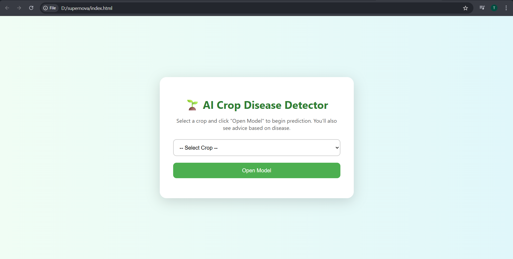
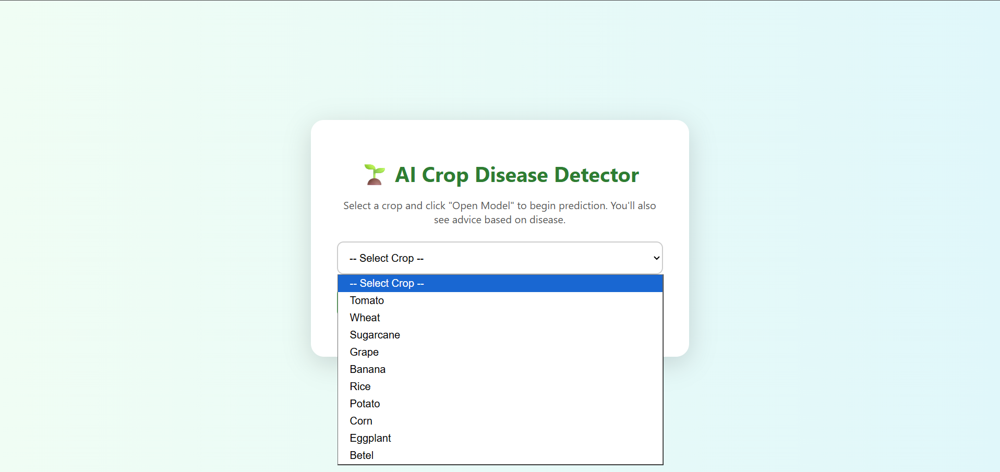
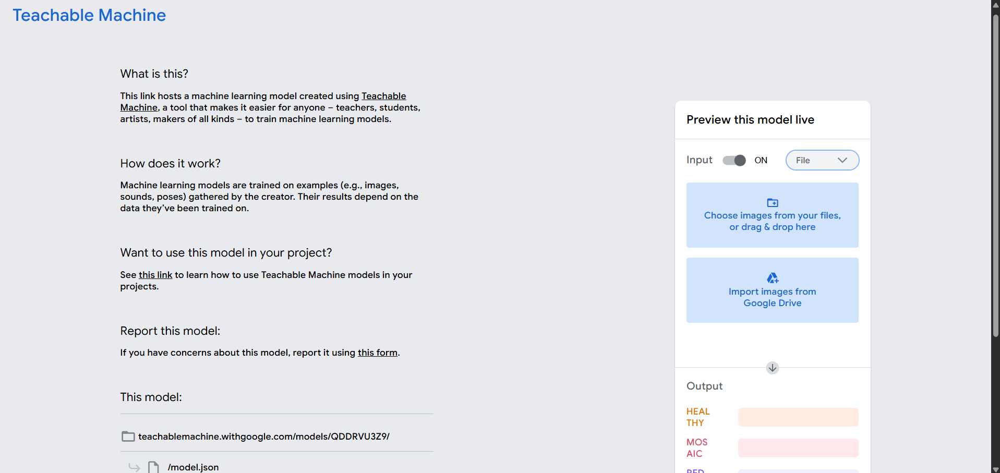
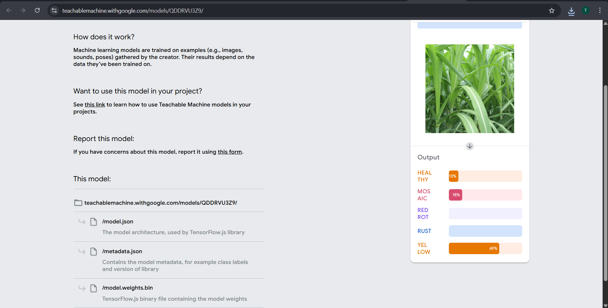
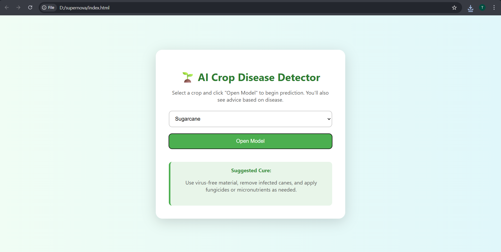

# AI Crop Disease Detector

An AI-based web application that helps detect crop diseases and provides basic treatment suggestions to improve crop health.

## Project Overview
The AI Crop Disease Detector is a simple web-based tool that allows users to select a crop and open a trained AI model to detect possible plant diseases. The system also provides suggested cure or prevention advice for the selected crop.

This project aims to support smarter agriculture and help farmers identify crop problems quickly.

##  Supported Crops
- Tomato
- Wheat
- Rice
- Corn
- Potato
- Grape
- Banana
- Eggplant
- Sugarcane
- Betel

## Features
- Crop selection interface
- AI disease detection models
- Cure and prevention advice
- Simple and user-friendly interface
- Supports multiple crops

## Technologies Used
- HTML
- CSS
- JavaScript
- Teachable Machine AI models

## Sustainable Development Goal
This project contributes to **SDG 2: Zero Hunger** by promoting healthier crops and reducing agricultural losses due to plant diseases.

## Future Improvements
- Direct leaf image upload for disease detection
- Mobile-friendly interface
- More crop disease datasets
- Integration with real-time AI prediction

